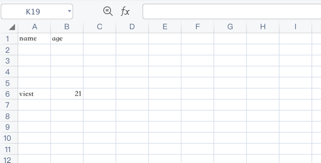

# Set current line

Move the write pointer to a later row before writing more data. Row numbers are zero-based: `0` is the first row, `1` is the second row, and `2` is the third row.

## Function Prototype

```php
setCurrentLine(int $row): self
```

## Example

```php
$config = [
    'path' => './tests'
];

$fileObject = new \Vtiful\Kernel\Excel($config);

$fileObject->fileName('tutorial.xlsx')
    ->header(['name', 'age'])
    ->setCurrentLine(6)
    ->data([
        ['viest', 21],
    ]);
```


