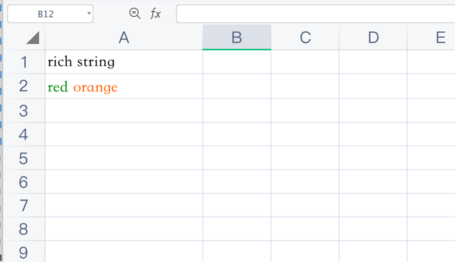

# Rich text

Use `Vtiful\Kernel\RichString` with `insertRichText()` to write several text runs with different styles into one cell.

## Example

```php
$config = [
    'path' => './tests'
];

$fileObject = new \Vtiful\Kernel\Excel($config);

$fileObject = $fileObject->fileName('rich_string.xlsx')
    ->header(['rich string']);

$fileHandle = $fileObject->getHandle();

$format1 = new \Vtiful\Kernel\Format($fileHandle);
$green = $format1->fontColor(\Vtiful\Kernel\Format::COLOR_GREEN)->toResource();

$format2 = new \Vtiful\Kernel\Format($fileHandle);
$orange = $format2->fontColor(\Vtiful\Kernel\Format::COLOR_ORANGE)->toResource();

$greenText = new \Vtiful\Kernel\RichString('green ', $green);
$orangeText = new \Vtiful\Kernel\RichString('orange', $orange);

$fileObject->insertRichText(1, 0, [
    $greenText,
    $orangeText
]);

$filePath = $fileObject->output();
```


